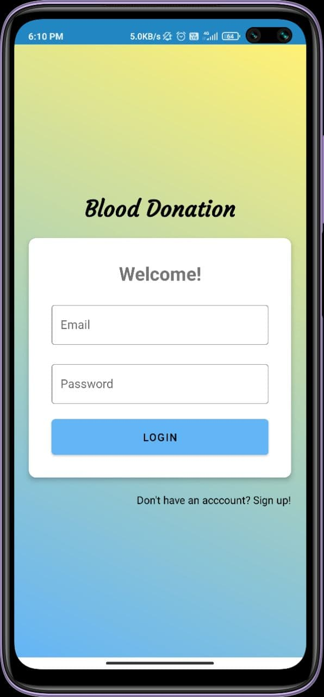
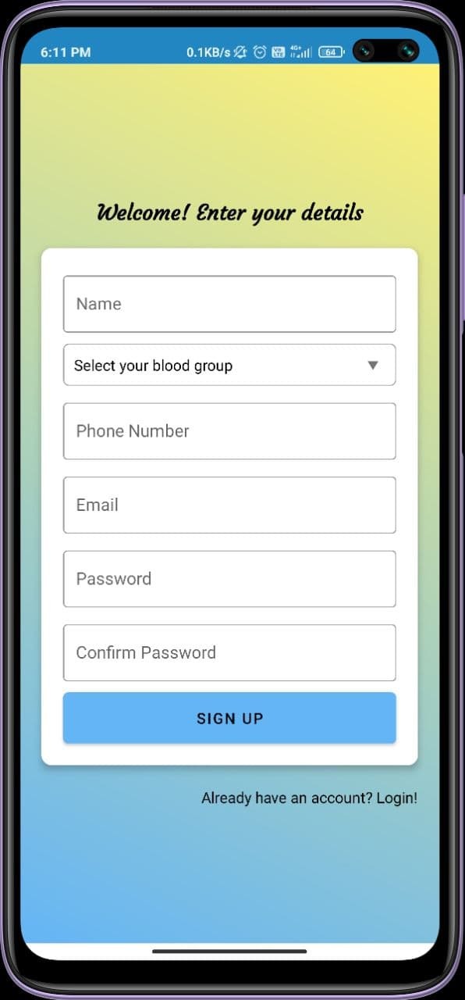
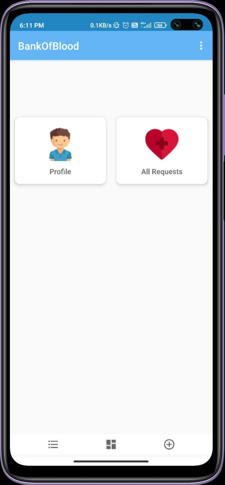
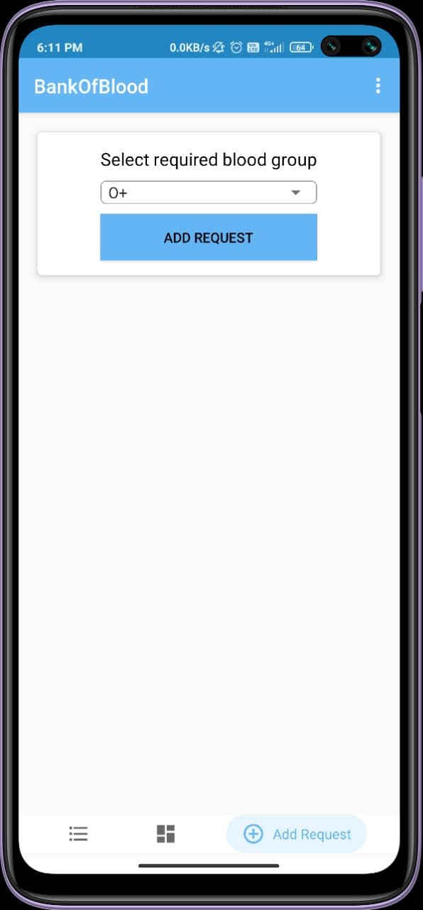
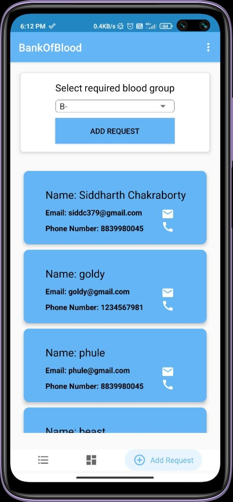
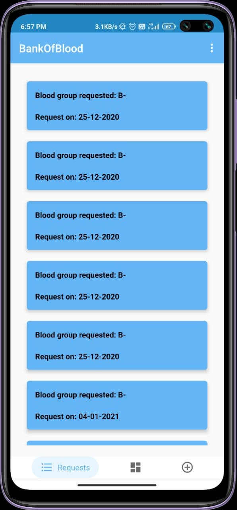

# BankOfBlood
[Link to kotlin files](https://github.com/SiddharthChakraborty1/BankOfBlood/tree/master/app/src/main/java/com/example/BankOfBlood)

## Working-

### - Login or Signup

<pre>
               
</pre>

### - After logging in, user will be directed to the dashboard. 
<pre>
   
</pre>

### - From there, User can navigate to create a request using the bottom navigation bar.
<pre>

</pre>

### - After making a request, the user will be provided with a contact list of matching possible donors.
<pre>

</pre>

The user can click on the call or email icon to directly contact the donors

### - User can also view all the requets made by them when they go to the "Requests Tab" from the bottom navigation bar
<pre>

</pre>

completed functionalities-
1. Add request
2. viewing the requests user made

incomplete functionailities-
1. push notification for the donors
2. viewing every request made by every user
3. Editing user's profile
